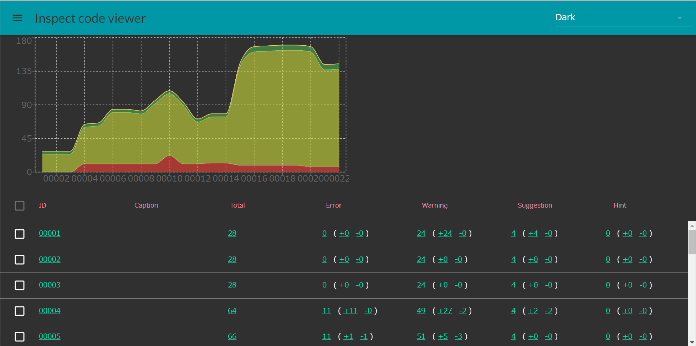

InspectCodeViewer
======================

This is a viewer for [Resharper InspectCode](https://www.jetbrains.com/resharper/features/command-line.html) Results.

## Description

Resharper is a powerfull refactoring and code review tool. And, InspectCode is a code review tool with same engine as Resharper.
However, there are only two viewers supports InspectCode results.
* [Jenkins warnings plugin](https://wiki.jenkins-ci.org/display/JENKINS/Warnings+Plugin)
* [Jetbrain TermCity](https://www.jetbrains.com/teamcity/)

These are too heavy to check code review results.

InspectCodeViewer is a simple tool.

## Live Demo

https://banban525.github.io/InspectCodeViewer/demo/

Live demo data is Resharper InspectCode results for this repository.

## Screenshop

## Requirement

This tool is required,
* .NET Framework 4.5.2

## Usage

1. Checkout a revision in your repository.
2. Execute InspectCode.exe in [Resharper Commandline](https://www.jetbrains.com/resharper/features/command-line.html) to save code issue results file (*.xml).

    InspectCode.exe --output=inspectCode.result.xml yoursolutionfile.sln "--disable-settings-layers:GlobalAll;GlobalPerProduct;SolutionPersonal;ProjectPersonal"

3. Execute ParseInspectedCodes.exe

    ParseInspectedCodes.exe --input c:\yourrepository\inspectCode.result.xml --base c:\yourrepository --link http://yourepository/hash --title hash

4. If you need to collect some revisions, repeat step 1 to step 3.

5. Execute UpdateRevisions.exe

6. Open index.html in your browser. If you will publish inspect code results, upload files (exclude *.exe,*.dll) to web server.

## Commandline options

### ParseInspectedCodes.exe

    -i, --input     Required. path for a InspectCode result file
    --id            revision id if you want to change id
    -o, --output    "revisions" folder path for output
    -b, --base      base directory to seach source codes
    -t, --title     revision title
    -l, --link      url to a revision in repository
    --help          Display this help screen.

## Contribution

1. Fork it
2. Create your feature branch (git checkout -b my-new-feature)
3. Commit your changes (git commit -am 'Add some feature')
4. Push to the branch (git push origin my-new-feature)
5. Create new Pull Request

## License

[MIT](/LICENSE.txt)

## Author

[banban525](https://github.com/banban525)